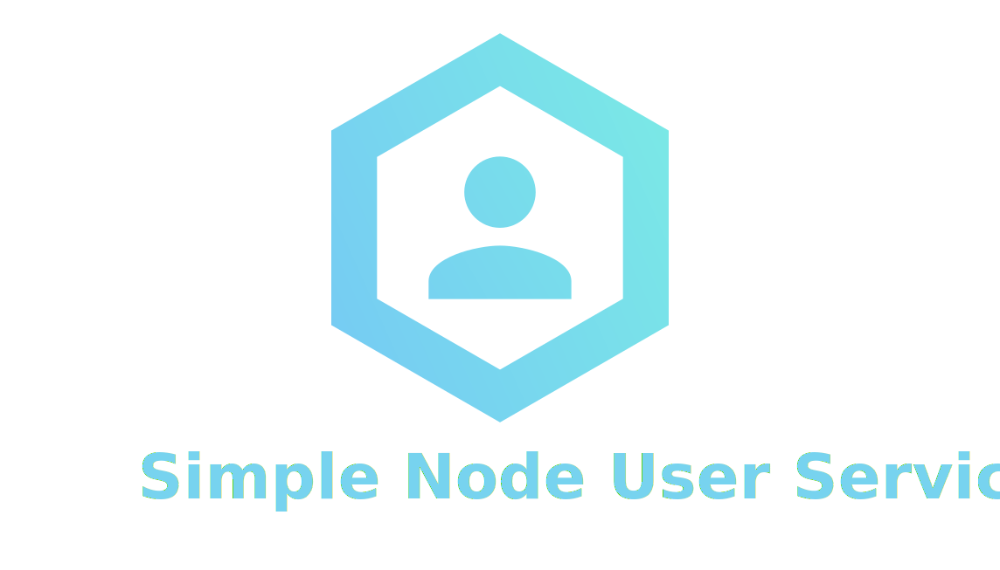

<h1 align="center">
  <br>
  
  <br>
  <br>
</h1>

> Extensible microservice for managing user accounts

[](https://github.com/sindresorhus/xo)

## Highlights
- Out of the box user microservice written in Node.js.
- Uses MongoDB for persistent file storage.
- Gain experience creating a public open source project
- Built with Docker and hosted on Docker Hub.
- Uses [Yarn](https://yarnpkg.com/) for package management.


## Usage

Simply download the source for this repository.

```
$ git clone https://github.com/figitaki/micro-user-service
$ cd micro-user-service
```

Once you have a copy of the repository, use docker to spin up
an instance of the container. By running `docker-compose up`
docker builds the mongo and web image and starts the server.

```
$ docker-compose up
```

## License

MIT &copy; [Carey Janecka](https://github.com/figitaki)
